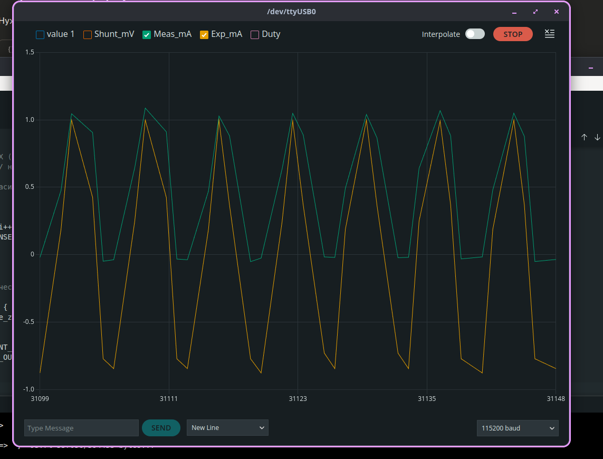
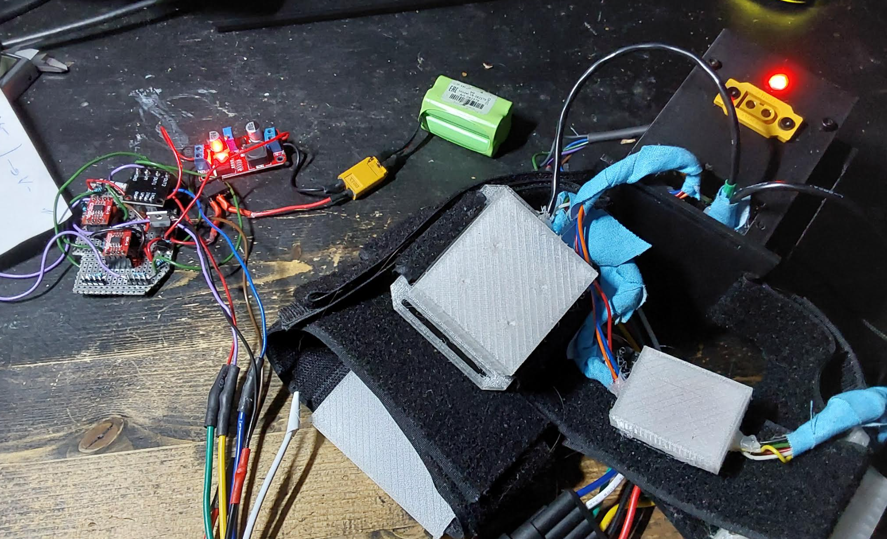

Stimulation Module (DRV8871 + INA240, Closed-Loop Current Control)

Bipolar constant-current stimulation driver for tACS/tVNS experiments, built on ESP32, DRV8871 H-bridge and an INA240 high-side current sensor. Implements arbitrary waveform generation with hardware-in-the-loop current regulation and safety protections.

Hardware Architecture

[NiMH 4.8V] -> [Shunt 10 Ohm] -> [Boost DCDC 30V] -> [DRV8871 H-bridge] -> [Load / Electrodes]    
                  
                  [Shunt 10 Ohm]
                        |    
                  [INA240, gain 20, Vref ~ 1.65V]  
                        |    
                  [ESP32 ADC pin 33]    

The current shunt sits in the positive supply line before the boost converter, not in the load path. This means:    
- Shunt voltage is always positive regardless of stimulation polarity    
- Measured current is the battery-side current, related to load current via DCDC power balance: I_load = I_bat * (V_bat / V_out) * eff * k_cal    
- A single-ended INA biased at mid-rail (~1.65 V) is sufficient    

Features

- Waveforms: sine, square, triangle (extensible)    
- Adjustable amplitude in microamps (g_target_amplitude_ua)    
- Adjustable frequency in Hz (g_stim_freq_hz)    
- Bipolar drive via DRV8871 H-bridge (PWM on IN1 / IN2 alternately)    
- Feedforward + PI control loop running at 1 kHz, non-blocking    
    * Feedforward predicts duty cycle from Ohm's law and nominal load resistance    
    * PI corrects for actual measured current vs. target    
    * Integral resets at every polarity change    
- PWM: 20 kHz, 8-bit resolution    
- ADC oversampling (16x) on the INA output to suppress PWM-synchronous aliasing    
- Zero-current auto-calibration of the INA reference voltage at startup (DCDC idle load)    
- Empirical current calibration constant to compensate for DCDC duty-dependent transfer ratio    

Safety Protections    

- Overcurrent       : if I_measured > HARD_CURRENT_LIMIT_MA, bridge OFF for FAULT_COOLDOWN_MS      
- Open load         : no current for NO_CURRENT_TIMEOUT_MS while target != 0 -> duty clamped to MAX_DUTY_WHEN_NO_CURRENT, integrator reset    
- Polarity switch   : target sign changes -> integrator reset to avoid back-charge spike    
- Dead zone         : |I_target| < DEADZONE_MA -> both bridge inputs LOW    

Telemetry    

Streams over USB serial at 50 Hz in a plotter-friendly format:    

    Shunt_mV:1652.3,Meas_mA:0.987,Exp_mA:1.000,Duty:84,Fault:0

- Shunt_mV : raw INA output in millivolts    
- Meas_mA  : reconstructed load current      
- Exp_mA   : commanded target current    
- Duty     : current PWM duty applied to the active bridge leg    
- Fault    : open-load suspect flag    

Key Parameters    

g_stim_freq_hz          - waveform frequency, Hz    
g_target_amplitude_ua   - current amplitude, uA    
g_stim_form             - WAVE_SINE / WAVE_SQUARE / WAVE_TRIANGLE    

ISENSE_SHUNT_OHMS       - shunt resistance, Ohm    
ISENSE_INA_GAIN         - INA gain    
V_BAT, V_OUT            - battery and boost voltages, V    
DCDC_EFFICIENCY         - assumed converter efficiency    
CURRENT_CALIBRATION     - empirical correction multiplier    
LOAD_R_OHMS_NOMINAL     - expected load for feedforward, Ohm    

STIM_KP, STIM_KI        - PI gains    
HARD_CURRENT_LIMIT_MA   - overcurrent shutdown threshold    

Co-existence with the main ADC pipeline    

The stimulation loop runs from loop() using a 1 ms time-slice (micros() based, no delay()), interleaved with ADS1263 data reads driven by PIN_DRDY. Stimulation does not block the ADC stream and vice versa.    

Known Limitations    

- Current is measured before the boost converter, not in the load. Measurement accuracy depends on DCDC operating regime (PFM bursts at low load can add ripple)    
- CURRENT_CALIBRATION must be tuned per board; default value (2.0) is empirical for ~10 kOhm load at ~1 mA    
- Feedforward assumes a nominal load resistance; large deviations are still corrected by PI but with transient lag    
- For medical-grade accuracy, a second current shunt directly in the load path is recommended    

Tested Conditions    

- Boost output : 30 V    
- Load         : 10 kOhm resistive    
- Amplitudes   : 0.1 - 2 mA    
- Frequencies  : 0.1 - 40 Hz (sine, square, triangle)    

Acknowledgements    

This stimulation module was developed iteratively with the assistance of large language models:    
- Claude (Anthropic) - control loop architecture, feedforward + PI design, safety protection layer, debugging of current sensing issues (PWM aliasing, sign convention, DCDC power-balance modeling)    
- Gemini (Google) - initial draft of the closed-loop stimulation prototype, waveform generation scaffolding, integration with the existing ADS1263 acquisition pipeline    

All code was reviewed, tested on hardware, and adjusted by the author. AI suggestions were used as design input, not as final implementation.   
## ⚠️ Disclaimer
The project is under development and is not for self-experimentation.  

